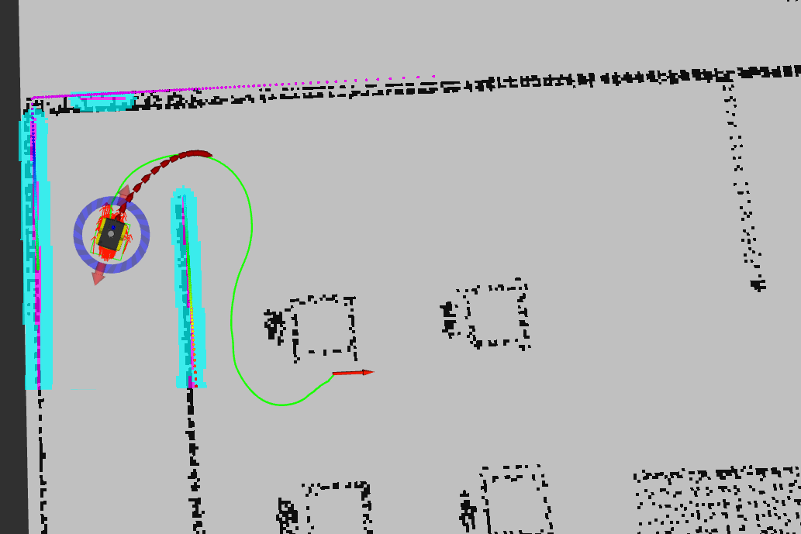

# mobile_final_group12
This repository is the implementation for ME5413 Autonomous Mobile Robotics Final Project
>Created by Group 12


## Dependencies
The requirement can be found in https://github.com/NUS-Advanced-Robotics-Centre/ME5413_Final_Project and also an extra ros package
  * `pcl_ros` is used for generating pcl file from rostopic
  * `teb_local_planner` is used for local path plan, you need use the following command to install this package:
  ```bash
  sudo apt-get install ros-noetic-teb-local-planner
  ```
## Installation
This repo is a ros workspace, containing several rospkgs:
* `ALOAM` is SLAM algorithm package used for 3D mapping
* `costmap_prohibition_layer` provides a plugin to add virtual obstacle in costmap to set prohibited region
* `interactive_tools` are customized tools to interact with gazebo and your robot
* `jackal_description` contains the modified jackal robot model descriptions
* `jackal_navigation` contains a probabilistic localization system for navigation
* `me5413_world` the main pkg containing the gazebo world, and the launch files
* `pcd2pgm` for converting pcd file to pgm map which can be used for navigation
```bash
# Clone this repo
cd
git clone https://github.com/zzf-zzf/mobile_final_group12.git
cd mobile_final_group12


# Install all dependencies
rosdep install --from-paths src --ignore-src -r -y

# Build
catkin_make
# Source 
source devel/setup.bash
```
To properly load the gazebo world, you will need to have the necessary model files in the `~/.gazebo/models/` directory, which installation instructions can be found in URL above.
## Usage
### 1. Mapping
Following commands will launch the gazebo with the project world
```bash
# Launch Gazebo World together with our robot
roslaunch me5413_world world.launch
```
In the second terminal, launch A-LOAM SLAM for 3D Lidar
```
source devel/setup.bash
roslaunch aloam_velodyne aloam_velodyne_VLP_16.launch 
```
In order to drive the robot around for mapping, launch keyboard control node in the third terminal
```
rosrun teleop_twist_keyboard teleop_twist_keyboard.py 
```
By above you can visualize pointclouds, and finish mapping by exploring all possible areas

To save the pointclouds in a pcl file, run rosnode in `pcl_ros` package to generate file in current direction
```
rosrun pcl_ros pointcloud_to_pcd input:=/laser_cloud_surround
```

To convert the pcl file to pgm format, run rosnode in `pcd2pgm` package after modify the path in `test.cpp`
```
private_nh.param("file_directory", file_directory, std::string("/home/($ your_username)/pcd/")); # the path to pcd file
```
```
private_nh.param("file_name", file_name, std::string("12673.944000000")); # the name of the pcd file
```
Then build the workspace again and run the rosnode
```bash
cd ~/mobile_final_group12
catkin_make
rosrun pcd2pgm pcd2topic
```
And run map saver in another terminal
```
rosrun map_server map_saver
```
After transforming you can obtain the global map by 3D Lidar SLAM like below and also a corresponding .yaml file， rename both as my_map and put them into `src/me5413_world/maps/`


### 2. Navigation
To begin with adding prohibited region in the map, find `prohibition_areas.yaml` in `mobile_final_group12/src/jackal_navigation/params/map_nav_params/` and modify the following content in the file to the desired one
```bash
prohibition_areas:

# define an obstacle point
# - [17.09, -6.388]
 
# define  an obstacle line
 - [[4.5, 1.5],
    [4.5, 5.0]]
 - [[1.0, 1.0],
    [3.0, 1.0]]

# define  an obstacle region
#- [[-11.15, -15.614],
#   [-12.35, -13.89],
#   [-10.05, -12.218]]
```
After that, also check if following lines in `move_base.launch` in `jackal_navigation` package,
```
<rosparam file="$(find jackal_navigation)/params/map_nav_params/prohibition_areas.yaml" command="load" ns="global_costmap/costmap_prohibition_layer" />
<rosparam file="$(find jackal_navigation)/params/map_nav_params/prohibition_areas.yaml" command="load" ns="local_costmap/costmap_prohibition_layer" />
```
Then, add follow code to `global_costmap_params.yaml`:
```
plugins:
- {name: static_layer, type: "costmap_2d::StaticLayer"}
# - {name: obstacles_layer, type: "costmap_2d::ObstacleLayer"}
- {name: inflater_layer, type: "costmap_2d::InflationLayer"}
- {name: costmap_prohibition_layer, type: "costmap_prohibition_layer_namespace::CostmapProhibitionLayer"}
```
Close all terminals and start new one in the workspace
```bash
source develop/setup.bash
roslaunch me5413_world world.launch
```
In the second terminal launch the navigation node
```bash
source develop/setup.bash
roslaunch me5413_world navigation.launch
```
Click the buttons of the bottom right panel in rviz and navigation to the specified pose



### 3. Random start and end point
If you  want to change the initial position of robot and set different goal pose, you should change follow code at `amcl.launch` which is define the load position ar rviz:
```
<param name="initial_pose_x" value="($ x position you want)" />
<param name="initial_pose_y" value="($ y position you want)" />
<param name="initial_pose_a" value="($ angle you want)" />
```
```
<!-- <param name="base_local_planner" value="base_local_planner/TrajectoryPlannerROS"/> -->
<!-- <param name="base_local_planner" value="dwa_local_planner/DWAPlannerROS" /> -->
<param name="base_local_planner" value="teb_local_planner/TebLocalPlannerROS" />
```
Then change corresponding code at `spawn_jackal.launch` which define the position at gazebo:
```
<node name="urdf_spawner" pkg="gazebo_ros" type="spawn_model"
	      args="-urdf -model jackal -param robot_description -x 0 -y 0 -z 1 -R 0 -P 0 -Y 0" />
<!-- the value of parameter should same as `amcl.launch` -->
```
### 4. Change the navigation algorithm
If you want to use other gloabl or local planner algorithm, you should adjust the following code at `move_base.launch`:
```
<!-- <rosparam file="$(find jackal_navigation)/params/base_local_planner_params.yaml" command="load" /> -->
<!-- <rosparam file="$(find jackal_navigation)/params/dwa_local_planner_params.yaml" command="load" /> -->
<rosparam file="$(find jackal_navigation)/params/teb_local_planner_params.yaml" command="load" />
```
Our repo gives three local plan algorithm to use, the default is `teb_local_planner`, if you want to use other, you just need to comment now algorithm and select which you want, but if you want to use external algorithm, you not only need to change this parameters, but also need to add parameter file like `teb_local_planner_params.yaml`.

For global algorithm, the default is good, but if you prefer other algorithm, you can change following code at `move_base.launch` and add configuration file：
```
<param name="base_global_planner" type="string" value="navfn/NavfnROS" />
```

## Get Support

If you have any questions please feel free to open a pull-request

## License

The [mobile_final_group12](https://github.com/zzf-zzf/mobile_final_group12.git) is released under the [MIT License](https://github.com/zzf-zzf/mobile_final_group12/blob/main/LICENSE)
